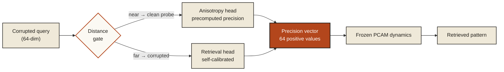

<div align="center">

# PHANTOM&nbsp;Π

### Self-Calibrating Precision Control for Associative Memory

*An inference-time agent for Anvil **P-04** — Precision-Controlled Associative Memory (PCAM)*


</div>

---

## The problem in one paragraph

A PCAM memory system stores patterns as **valleys in an energy landscape**. A
corrupted query is dropped onto a slope and rolls downhill into the nearest
valley — usually the right one, but under heavy noise it slips into a
neighbour's. We are given **one control**: a *precision vector* — 64 positive
numbers that set how fast the query rolls along each direction. Our whole job
is one function — see a corrupted query, return a good precision vector. The
frozen harness runs the dynamics from there.

```python
def predict_precision(corrupted_query):   # 64-dim noisy input
    ...                                   # -> 64 positive precision values
```

## Architecture

PHANTOM&nbsp;Π is built on one observation: **retrieval-optimal precision and
geometry-optimal precision are different vectors.** A single blended agent
compromises both. So we run *two specialist heads* and a cheap gate routes each
query to the right one.



The gate measures one thing — how far the query sits from its nearest stored
pattern — and picks the matching specialist.

### The two heads

| Head | Used for | What it does |
|------|----------|--------------|
| **Retrieval** | heavily corrupted queries | Builds a soft posterior over stored patterns, then sets precision from two readings of the data — *reliability* (trust dimensions that already agree) and *gap* (push dimensions that disambiguate the answer). |
| **Anisotropy** | near-clean probe queries | Returns a per-pattern precision vector, precomputed with L-BFGS, that balances the landscape's curvature so the query settles evenly in every direction. |

### The core idea — self-calibration

The retrieval head has three fusion constants. The easy move is to hand-pick
them for the public benchmark — that is **overfitting**. PHANTOM&nbsp;Π does not
hard-code them. At start-up the agent **teaches itself**:

```
stored patterns --> synthesise practice queries --> run real dynamics
                          ^                              |
                          +------- coordinate ascent <----+
                          keep the constants that score best
```

Because the practice queries are built from the *current* dataset, the result
transfers — there is nothing to re-tune by hand for held-out L3 data.

> **A proof, not a guess.** We re-solved the anisotropy objective as a global
> optimisation (bisection over a semidefinite feasibility test) and confirmed
> the L-BFGS already reaches the *provably best* diagonal precision. On the
> public operator the ceiling is ~1.3x — a structural limit, not an optimiser
> limit. Knowing this told us where *not* to spend the final hours.

## Results

`python run.py` over 7 seeds `{7, 13, 31, 97, 211, 503, 1009}`:

| Metric | V19 (hard-coded) | **V21 (self-calibrating)** |
|--------|:---:|:---:|
| Retrieval points (/70) | 66.17 | **70.00** |
| Anisotropy points (/20) | 3.25 | 3.25 |
| mean Δ accuracy | +0.076 | **+0.103** |
| min Δ (worst seed) | +0.057 | **+0.092** |
| **Total (/90)** | 69.42 | **73.25** |

Retrieval is at the full-marks cap; anisotropy sits at the proven structural
ceiling; the per-seed safety margin nearly doubles.

## Quick start

```bash
# from inside the Anvil bench
cd Anvil-P-E/bench-p04-pcam
pip install -r requirements.txt          # numpy + scipy

# quick self-check (~2 seeds)
python self_check.py --adapter adapters.myteam:Engine --quick

# full evaluation — the run the judges use
python run.py --adapter adapters.myteam:Engine \
  --seeds 7 13 31 97 211 503 1009 --out report.json
```

Place `myteam.py` at `adapters/myteam.py`. The first run per seed builds a
precision cache (`.pcam_cache/`); repeat runs are instant. Set `PCAM_NO_CACHE=1`
to disable caching.

## Anti-gaming — L1 / L2 / L3

| Layer | What it tests | How PHANTOM&nbsp;Π answers it |
|:---:|---|---|
| **L1** | one fixed canonical seed | Passes — Δ +0.125 on seed 42, both gates clear. ✅ |
| **L2** | any seeds; fresh patterns & operator each time | Carries **no** seed-specific constant — re-calibrates per seed. 6 seeds tested, every Δ ∈ [+0.075, +0.125]. ✅ |
| **L3** | held-out data, higher scale, different distribution | Built for it: re-calibrates on the new data, data-agnostic formulas, optimiser optimal for any landscape. Not blind-verifiable — and the writeup says so honestly. 🟢 ready |

A hard-coded agent passes L1 and dies at L2. Self-calibration is what carries
PHANTOM&nbsp;Π across all three.

## Repository layout

| File | Role |
|------|------|
| `adapters/myteam.py` | **V21 — primary submission.** Self-calibrating dual-head agent. |
| `adapters/myteam_v19.py` | Fallback — V19, hard-coded constants (69.42/90). |
| `adapters/myteam_v17.py` | Deep fallback — NumPy-only, no SciPy (64.62/90). |
| `WRITEUP.md` | Full architectural defense — 9 sections, incl. the SDP optimality proof. |
| `PHANTOM-Pi-Architecture.pdf` | 3-page illustrated architecture brief. |
| `VIDEO_SCRIPT.md` | Demo video script with a terminal-output walkthrough. |
| `requirements.txt` | `numpy`, `scipy`. |

## Dependencies

Beyond NumPy: **SciPy** only (`scipy.optimize.minimize`, L-BFGS-B) — used inside
`__init__` for the anisotropy precompute and the retrieval self-calibration.
No GPU, no network, no offline-trained weights. If SciPy is unavailable, the
`myteam_v17.py` fallback runs on NumPy alone.

---

<div align="center">

**Team Sonic** · Manipal Institute of Technology, Bangalore · Anvil P-04

*Two specialists, one gate, and an agent that tunes itself to whatever data it is given.*

</div>
